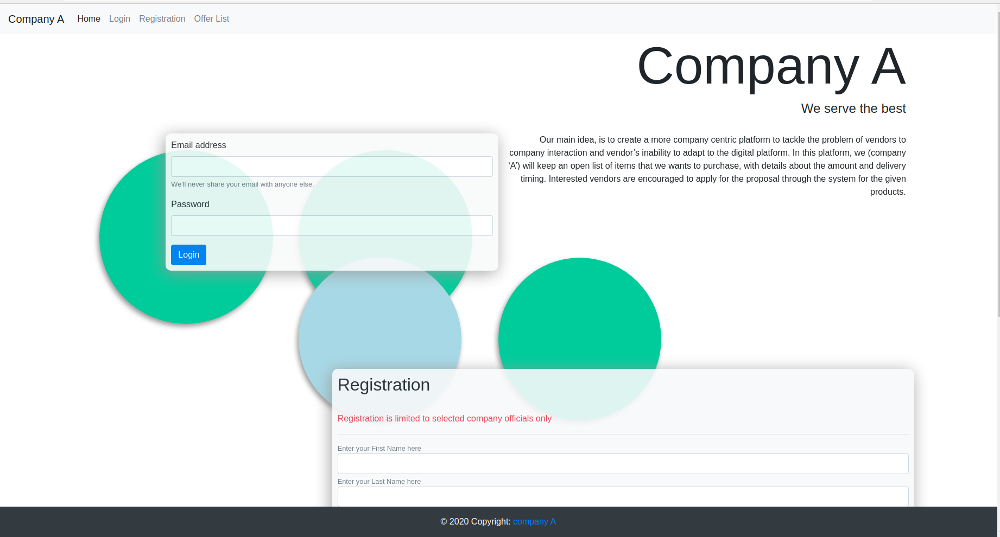
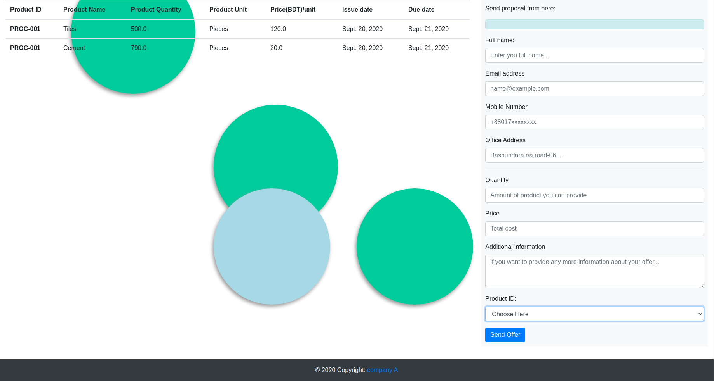
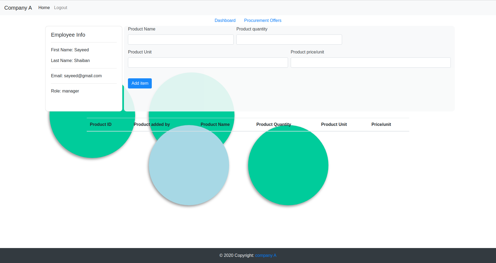
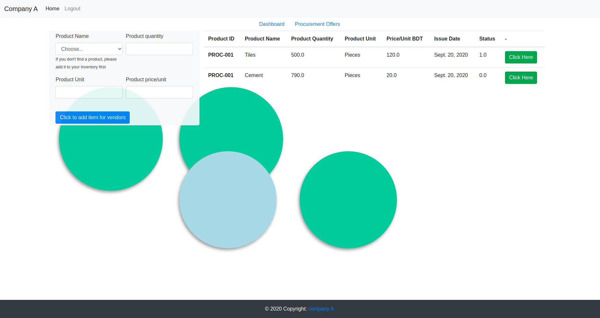

  <h1 align="center">HACKNSU SEASON 2.0</h1>
  
HACK TO THE FUTURE

  
SPONSORED BY SHOMOY TECHNOLOGIES LTD.

<h3 align="center">TEAM 'RED RIOT'</h1>

Our main idea, is to create a more company centric platform to tackle the problem of vendors to company interaction and vendor’s inability to adapt to the digital platform. In this platform, company ‘A’ will keep an open list of items it wants to purchase, with details about the amount and delivery timing. This window can be seen by any vendor to send a proposal on the items as per their specification.

This proposal will then be monitored by the company representative to choose the best offer and send the acceptance message.

For dealing with shortage of products from the vendor side, company ‘A’ can contact with the vendors and increase the delivery time or decide to update the open list of products with updated amount for new vendors to be able to send proposal for the item.

<h4>1. Technology Stack: </h4>

<ul>
  <li><b>Front-end:</b> We used HTML, CSS and Boostrap framework for the design structure of the application</li>
  <li><b>Back-end:</b> Django Framework was used to implement the logical part of the application. For the database we opted to use the default django sqlite database(This decision was taken due to the fast pace of the 3 days Hackathon contest). </li>
</ul>

<h4>2. Software specification:</h4>

The application features are described below:
<h4>2.1 Home page:</h4>

This page contains both the login and registration forms for the company side. It also contains a link to the procurement offers that will be provided by company 'A'.

 
Figure 1.0

<h4>2.1.1 Login:</h4>
 
The login form takes email and password and checks the credentials with the 'USER' entity of the database. It also checks errors via Django's default error form check through 'ModelForm' class
 

 <h4>2.1.2 Registration</h4>

The registration form takes the necessary information like First name, Last name, Email, Role in the company, password. After registering the admin needs to check the role and credentials of the company 'A' employee. If the everything checks out the admin need to mark the status of the account as 'active' for the registered user to gain access (by default this is not activated after registering).
  

  

   
  Figure 2.0
  

  <h4>2.1.2 Offer List</h4>
 
The offer list contains all the offers provided by the company thats open for all vendors to see. This page also contains the form to send the proposal for the product
   

   

    
   Figure 3.0
   

   <h4>2.2 Dashboard:</h4>
   
This view contains all the necessary information that the company representative needs to know.
   

   <h4>2.2.1 Inventory</h4>
  
The Dashboard contains the company 'A' inventory. Company 'A' representative can check the inventory and add items accordingly to the list
  

    

     
    Figure 4.0
  

  <h4>2.2.2 Procurement Offer</h4>
 
This contains a table of the offers received from vendors and products offered for procurement. Any products thats low in inventory can be added via the form here to add it to the procurement list.
 

   

    
   Figure 4.0
 

 <h4>2.2.3 Proposal list</h4>
 
This contains all the proposals sent by the vendor. Representative can choose to accept the proposals here. This will trigger a acceptance message to the vendor with a unique ID.
 

   

    
   Figure 4.0
 

